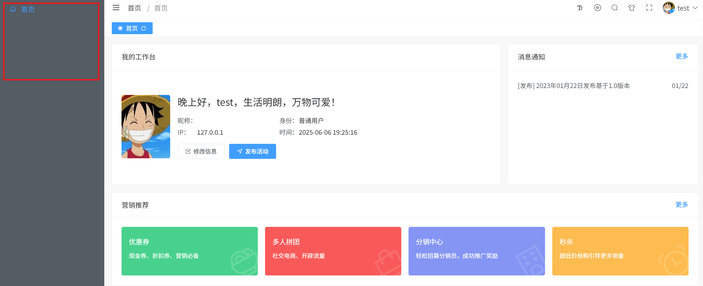
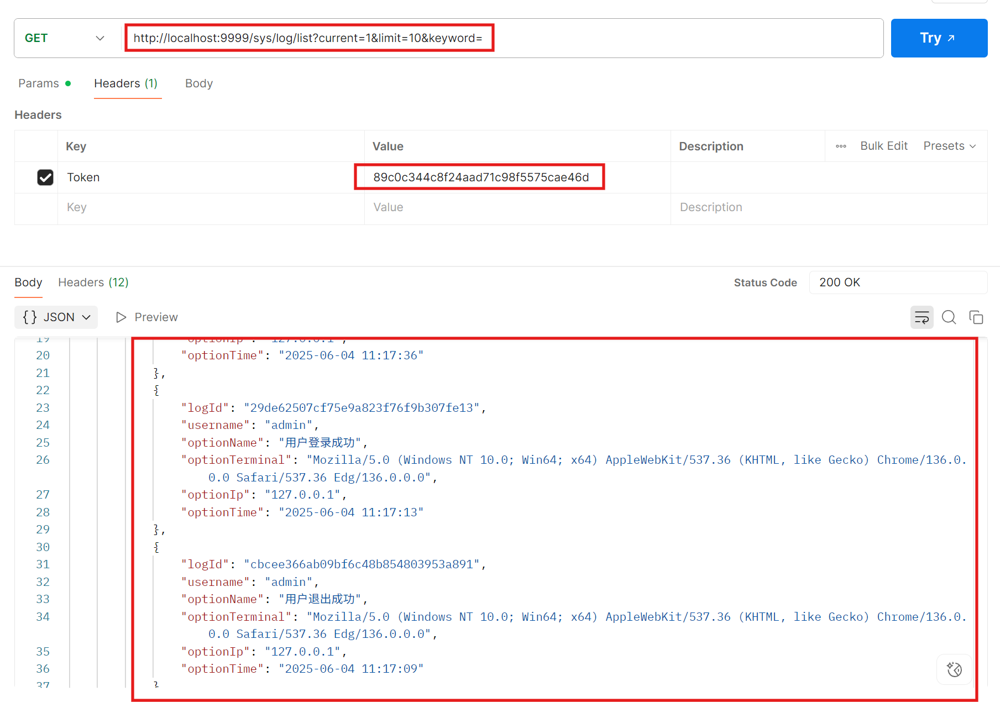
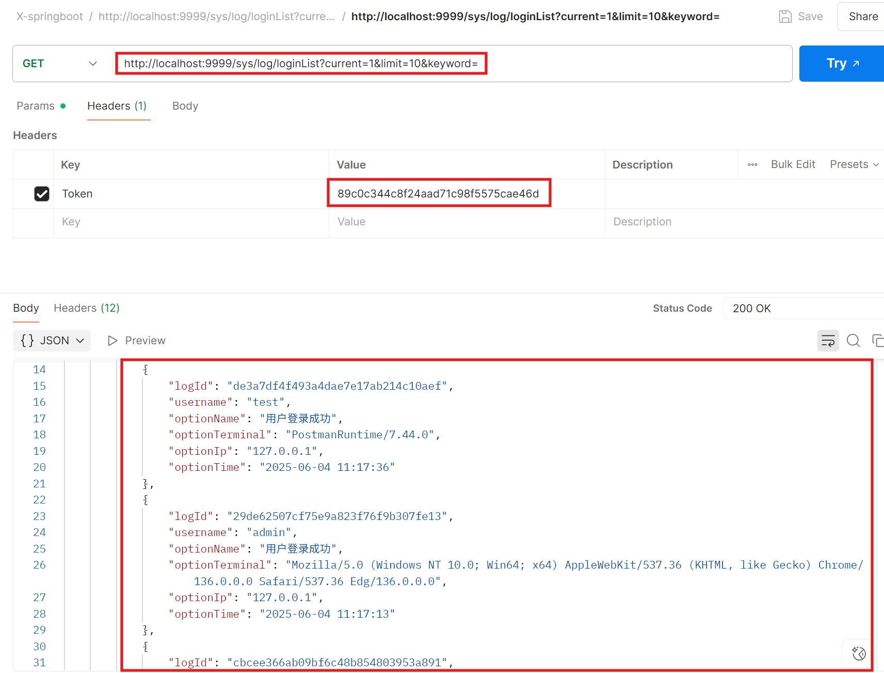
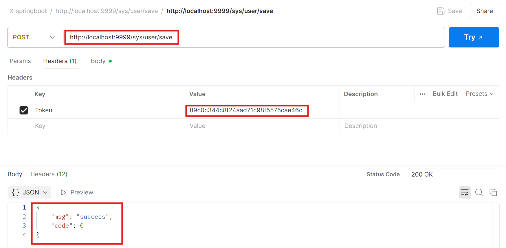

# X-SpringBoot Project Vertical Privilege Escalation Vulnerabilities

The X-SpringBoot project is a project on GitHub with 2.5k stars, and it has vertical privilege escalation vulnerabilities. Users can use tools such as Postman to query information that they do not have permission to view or update.

## Version & Reference

x-springboot project 5.1

https://github.com/yzcheng90/X-SpringBoot

## Vulnerability Reproduce & Impact

Register a user named 'test' as an administrator and assign user 'test' a role that only allows it to view the homepage. Login to the 'test' user and find that it can only view information on the homepage in the front end.

However, when using the Postman to send a request to view logs with the user 'test' token, it was found that the received response included all logs, including admin logs.

Both of the url /sys/log/list and the /sys/log/loginList have the vulnerability above.

Use the token of the 'test' user to send a request to create a new user (user 'test' does not have the role permission to create a user). It was found that the response was successful and the new user was successfully created in the database(including admin role user).

These vulnerabilities only requires normal user privileges to cause the information disclosure and loss of system control.