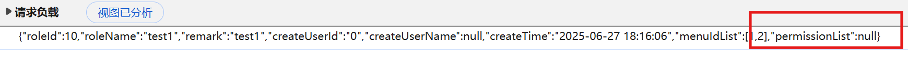
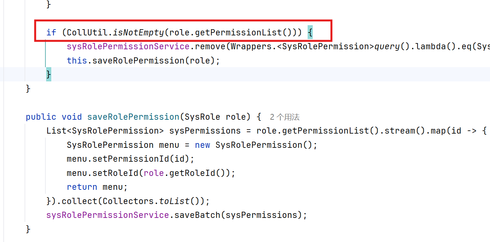
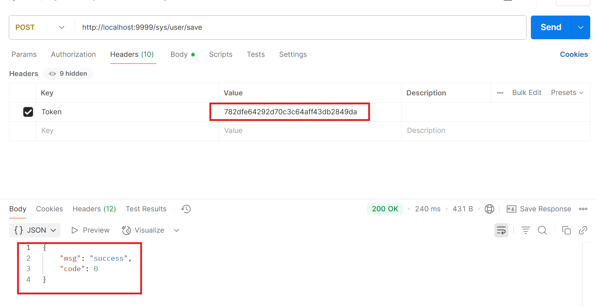

# X-SpringBoot3x Project Privilege Revocation Failure Vulnerability

The X-SpringBoot project is a project on GitHub with 2.5k stars, and it has *Privilege Revocation Failure* vulnerability. Users may can use tools such as Postman to query information that they do not have permission to operate.

## Version & Reference

x-springboot project 6.0

https://github.com/yzcheng90/X-SpringBoot/tree/springboot3x

## Vulnerability Reason

The reason for the vulnerability is that when the web front-end sends a request to create or modify role permissions, the *PermissionList* is always null.

In backend code (\src\main\java\com\suke\czx\modules\sys\service\impl\SysRoleServiceImpl.java), if the *PermissionList* in requests is empty, no action is taken.

So if a user modifies the permissions of a role using the frontend, the corresponding permissions in the database will not change (the database table *sys_role_permission*).

## Vulnerability Reproduce & Impact

Create a user 'test1' which has the role permission to save users.

Modify the role permission of user 'test1' using admin privileges in the front-end webpage, so that it does not have the permission to save users.

Use the token of the 'test1' user to send a request to create a new user. It was found that the response was successful and the new user was successfully created in the database.

The Privilege Revocation Failure vulnerability causes when a role reduces its privileges, the original privileges are not properly reclaimed, and the user still retains operational capabilities beyond the actual authorized scope.